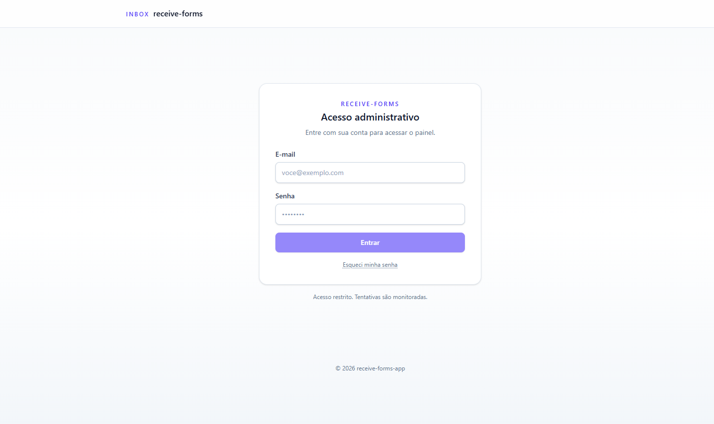

# receive-forms


Admin dashboard + ingestion API for a contact form hosted on an **external** professional website.

- The contact form itself lives on the user's professional/portfolio website — it is **not** part of this repo.
- This app's backend exposes a single public endpoint that **receives** submissions from that external site, plus admin endpoints to list and read stored messages.
- This app's frontend is the **admin dashboard** that lists the submissions stored by the backend and lets the operator open one to read its full content.

Stack:
- `receive-forms-app` — Vite + React + TypeScript + Tailwind CSS v4 SPA (dashboard)
- `receive-forms-api` — Node.js + Express 5 + TypeScript + TypeORM REST API
- PostgreSQL persistence (with `pg_trgm` for fast ILIKE search)
- Docker images for both services and Kubernetes manifests for a Traefik-backed cluster

## Repository layout

```
receive-forms-app/
  backend/           # receive-forms-api (Express + TypeORM)
  frontend/          # receive-forms-app  (Vite + React)
  k8s/               # Kubernetes manifests (Namespace, Postgres, API, Web, Ingress, NetworkPolicy, migrate Job, Certificate)
  docker-compose.yml # Local one-shot stack (Postgres + API + Web)
  context.md         # Original spec
```

## Local development

### Prerequisites
- Node.js 20+
- Docker (only required for the compose flow / image builds)
- A reachable PostgreSQL 16 (or use the compose file)

### Backend
```bash
cd backend
cp .env.example .env
# Generate the JWT signing secret used by the session cookies.
echo "AUTH_JWT_SECRET=$(openssl rand -hex 48)" >> .env
# Seed the first admin (only runs while the users table is empty).
echo "ADMIN_BOOTSTRAP_EMAIL=admin@local.test" >> .env
echo "ADMIN_BOOTSTRAP_PASSWORD=ChangeMeNow-12!" >> .env
npm install
# Start Postgres separately (e.g. `docker compose up -d postgres`)
npm run migration:run   # apply schema before first boot
npm run dev             # tsx watch — hot reload
# Production build
npm run build && npm start
```

The API listens on `http://localhost:3000` by default.

Endpoints:
- `POST /api/contact` — **public** ingestion: creates a contact message from the external website.
  - Rate-limited to 5 req/min per IP.
  - 201 on success, 400 on validation, 429 on rate limit, 500 on error.
  - If `INGEST_HMAC_SECRET` is set, the request must include `X-Signature: sha256=<hex hmac of raw body>`.
- `GET  /api/contact` — **admin**: paginated list of submissions, newest-first. Requires an authenticated session (cookie) or, for server-to-server callers, `Authorization: Bearer <ADMIN_STATIC_TOKEN>`. Query params:
  - `page` (default `1`)
  - `pageSize` (default `20`, capped at `100`)
  - `q` — optional case-insensitive search across `name`, `email`, `message`
  - Response: `{ data: ContactMessage[], page, pageSize, total, totalPages }`
- `GET  /api/contact/:id` — **admin**: fetch one submission by UUID. Same auth as above. `400` for invalid UUID, `404` if not found.
- `POST /api/auth/login` — body `{ email, password }`. On success, sets HttpOnly cookies (access JWT + refresh + CSRF) and returns `{ user }`. Rate-limited to 5 attempts per minute per `(IP, email)`.
- `POST /api/auth/refresh` — silent session rotation. Reads the refresh cookie, rotates it, returns `{ user }`.
- `POST /api/auth/logout` — clears the cookies and revokes the refresh token. Requires the CSRF header.
- `GET  /api/auth/me` — returns `{ user }` for the current session; 401 if anonymous.
- `PATCH /api/auth/me/password` — self-service password change. Body `{ currentPassword, newPassword }`. On success, every other refresh token of this user is revoked (other devices get bumped) while the calling browser stays signed in. Rate-limited (5/min per IP). Requires CSRF.
- `POST /api/auth/password/forgot` — body `{ email }`. Always returns 204 (no enumeration). When the email matches a user, a one-shot reset token is generated and `sendPasswordResetEmail` is invoked. In dev that helper just logs the link to stdout — wire it to your email provider in production. Rate-limited to 3 requests per hour per IP.
- `POST /api/auth/password/reset` — body `{ token, newPassword }`. Consumes the reset token, writes the new password, and revokes every active session for the user. Rate-limited to 5/min per IP.
- `POST /api/auth/users` — admin-only. Creates a new admin. Body `{ email, password }` with password policy (min 12 chars, must contain a letter + a digit).
- `GET  /api/v1/health` — liveness probe (always returns 200 when the process is up).
- `GET  /api/v1/ready`  — readiness probe (checks DB connectivity). Returns `{status: "not-ready"}` on failure with no detail (errors stay in logs).

#### Backend environment variables
| Var | Required | Notes |
|-----|----------|-------|
| `NODE_ENV` | no | `development`/`production`/`test` |
| `PORT` | no | default `3000` |
| `LOG_LEVEL` | no | pino level: `fatal`/`error`/`warn`/`info`/`debug`/`trace` |
| `CORS_ORIGIN` | no | comma-separated allowlist (default `http://localhost:5173`) — must include the dashboard origin for cookie-credentialed CORS to work |
| `AUTH_JWT_SECRET` | **yes in prod** (unless `AUTH_JWT_KEYS` is set) | HS256 signing key for the session JWT. Min 32 chars. Generate with `openssl rand -hex 48`. In dev a random one is generated per boot (warning emitted). Tokens minted under this path carry `kid="default"`. |
| `AUTH_JWT_KEYS` | no | Multi-key JSON config for rotation. See [JWT key rotation](#jwt-key-rotation) below. When set, takes precedence over `AUTH_JWT_SECRET`. |
| `AUTH_ACCESS_TTL_SECONDS` | no | default `900` (15m) |
| `AUTH_REFRESH_TTL_SECONDS` | no | default `604800` (7d) |
| `AUTH_PASSWORD_RESET_TTL_SECONDS` | no | default `3600` (1h). One-shot tokens. |
| `AUTH_PASSWORD_RESET_URL` | no | Base URL the reset-link email points to. Default `http://localhost:5173/reset-password`. |
| `REFRESH_TOKEN_PURGE_INTERVAL_MS` | no | How often the housekeeping job sweeps expired refresh and reset tokens. Default `3600000` (1h). |
| `AUTH_COOKIE_SAMESITE` | no | `strict` (prod default) / `lax` (dev default) / `none` |
| `AUTH_COOKIE_SECURE` | no | always `true` in prod; opt-in for dev |
| `AUTH_ARGON_MEM_KIB` / `AUTH_ARGON_TIME_COST` / `AUTH_ARGON_PARALLELISM` | no | argon2id tuning (defaults: 19 MiB / t=2 / p=1) |
| `ADMIN_BOOTSTRAP_EMAIL` / `ADMIN_BOOTSTRAP_PASSWORD` | no | If both set AND the users table is empty, the server creates one admin on startup. See below. |
| `ADMIN_BOOTSTRAP_ALLOW_PROD` | no | Required to `true` to actually seed when `NODE_ENV=production`. |
| `ADMIN_STATIC_TOKEN` | no | Optional bearer token for server-to-server callers. Off by default. |
| `INGEST_HMAC_SECRET` | no | When set, public POST requires a valid `X-Signature: sha256=<hex>` of the raw body. Skip the check by leaving it empty. |
| `DB_HOST`/`DB_PORT`/`DB_USER`/`DB_PASSWORD`/`DB_NAME` | yes | Postgres connection |
| `DB_POOL_MAX` | no | default `10` |
| `DB_SYNCHRONIZE` | no | always `false` in prod — use migrations |
| `DB_LOGGING` | no | TypeORM query logging |

CORS is a browser UX layer, not a security boundary. The CORS callback rejects every request that doesn't carry a matching `Origin` header, including no-origin requests. Server-to-server callers should authenticate via the `ADMIN_STATIC_TOKEN` bearer instead.

#### Bootstrapping the first admin

Choose one:

1. **Env-driven bootstrap (recommended).** Set `ADMIN_BOOTSTRAP_EMAIL` and `ADMIN_BOOTSTRAP_PASSWORD` (and `ADMIN_BOOTSTRAP_ALLOW_PROD=true` in prod) before the first boot. The server creates that admin **only when the `users` table is empty**, so subsequent restarts are no-ops. Unset the bootstrap vars after the first user exists and rotate the password from the dashboard's "Usuários" page.
2. **Manual SQL.** Hash a password with argon2 (e.g. via `node -e "require('argon2').hash('YourPasswordHere').then(console.log)"` after `npm install`) and `INSERT INTO users (email, password_hash, role) VALUES (...)`.

Either way, log in at `/login`, then add subsequent admins through `/users` in the dashboard.

### Changing your own password

Authenticated users can change their password from the **Minha conta** page (linked from the email shown in the dashboard header, or directly at `/account`). The flow:

1. Submit the current password + new password (min 12 chars, must contain a letter and a digit).
2. On success the backend swaps the argon2id hash and **revokes every other refresh token of yours** — other devices are bumped to the login page on their next request. The browser making the change stays signed in.

If the current password is wrong the form shows a deliberately generic "Senha atual incorreta" message.

### Password reset (forgot password)

For a user who has lost their password:

1. Visit `/login` → click **Esqueci minha senha**, or jump straight to `/forgot-password`.
2. Enter the email address. The server always replies 204 — the UI shows "Se o email existir, enviamos instruções" regardless to defeat enumeration.
3. If the email matches a real user, a one-shot reset token is generated and `sendPasswordResetEmail` is invoked. **In development the token URL is logged to stdout** — copy/paste it to test the flow locally. **In production wire `sendPasswordResetEmail` (in `backend/src/controllers/authController.ts`) to your email provider** (SES, Postmark, SendGrid, …). The signature is stable so the integration is a one-file change.
4. The user opens the link `${AUTH_PASSWORD_RESET_URL}?token=<hex>`, types a new password, and lands back on `/login?reset=ok` with a confirmation toast.

Tokens are valid for 1 hour, single-use, and stored only as SHA-256 hashes in `password_reset_tokens`. A successful reset revokes every refresh token of the user so any session an attacker might have stitched together is invalidated.

Rate limits: 3 forgot/hour/IP, 5 reset/min/IP.

### JWT key rotation

JWTs are signed with HS256 and carry a `kid` (key id) in the header so verification can pick the right secret in O(1). Two configurations:

- **Single key (default).** Set `AUTH_JWT_SECRET=<hex>`. Tokens are signed/verified with `kid="default"`.
- **Multiple keys (for rotation).** Set `AUTH_JWT_KEYS` to a JSON array of `{kid, secret, active}` entries. Exactly one entry must have `active: true`; new tokens are signed with that one. Inactive entries still verify already-issued tokens until they expire.

Procedure to rotate live without forcing re-login:

1. Generate a new secret (`openssl rand -hex 48`).
2. Update `AUTH_JWT_KEYS` to include both keys, e.g.:

   ```env
   AUTH_JWT_KEYS=[{"kid":"k1","secret":"<new-hex>","active":true},{"kid":"k0","secret":"<old-hex>","active":false}]
   ```

3. Roll the API. Sessions minted under `k0` keep verifying; new ones are signed under `k1`.
4. **Wait at least `AUTH_ACCESS_TTL_SECONDS` (default 15 min)** so every JWT minted under `k0` has expired. Refresh tokens are server-side and live independently — they don't need waiting.
5. Drop the `k0` entry from `AUTH_JWT_KEYS` and roll the API again.

If `AUTH_JWT_KEYS` is unset the code falls back to `AUTH_JWT_SECRET` automatically — existing deployments don't need to migrate until they need to rotate.

### Frontend (dashboard)
```bash
cd frontend
cp .env.example .env
npm install
npm run dev            # http://localhost:5173
```

The dashboard exposes:
- `/login` — credentials form (with "Esqueci minha senha" link)
- `/forgot-password` — request a password-reset email (public)
- `/reset-password?token=<hex>` — exchange the emailed token for a new password (public)
- `/` — list of received submissions (search + pagination, auth-gated)
- `/messages/:id` — full detail of a single submission (auth-gated)
- `/users` — create new admin (auth-gated)
- `/account` — self-service password change (auth-gated; reachable from the email link in the header)

The Vite dev server proxies `/api` to `http://localhost:3000` so cookies set by the backend ride seamlessly with the SPA.

Auth is cookie-based: the backend sets an HttpOnly access JWT, an HttpOnly refresh token, and a JS-readable CSRF token. The SPA's axios interceptor mirrors the CSRF cookie into an `X-CSRF-Token` header on every non-GET request; the backend enforces a double-submit check. On 401 the SPA silently tries one `POST /api/auth/refresh` and, if that fails, drops the user back to `/login` while preserving the original path in `?next=`.

### Full local stack via Docker Compose
```bash
docker compose up --build
# SPA   -> http://localhost:5173
# API   -> http://localhost:3000
# DB    -> localhost:5432 (user/pass: postgres/postgres)
```

## Database migrations

The schema is owned by TypeORM migrations under `backend/src/migrations/`.
`DB_SYNCHRONIZE` is on by default in dev (convenience) and off in prod.

```bash
cd backend
npm run migration:run            # apply pending migrations
npm run migration:generate -- src/migrations/AddSomething
npm run migration:revert
```

The initial migration also creates the `pg_trgm` extension and GIN
trigram indexes on `name`, `email`, and `message` so the search query
stays fast as the table grows.

In Kubernetes, run `k8s/migrate-job.yaml` to apply migrations before
rolling out a backend release.

## Building production images

```bash
# Backend
docker build -t receive-forms-api:1.0.0 ./backend

# Frontend (optionally set API base URL at build time)
docker build \
  --build-arg VITE_API_BASE_URL="" \
  -t receive-forms-app:1.0.0 ./frontend
```

The frontend defaults to relative `/api` URLs, which is the recommended setup when both services are served behind the same Traefik host.

## Deploying to Kubernetes

Traefik is assumed to be already installed in the cluster (we do not ship Traefik manifests).

### Secrets workflow

The Secret manifests in `k8s/postgres.yaml` and `k8s/backend.yaml` carry
**placeholder values only** (`REPLACE_ME_*`). Do not commit real
credentials. Use one of:

- **SealedSecrets** (`kubeseal` produces an encrypted `SealedSecret` you can
  safely commit; the controller decrypts at apply time).
- **External Secrets Operator** pointing at Vault / AWS Secrets Manager /
  GCP Secret Manager / etc.
- **SOPS** with `kustomize` (`ksops`) or `helm-secrets`.

All three resolve to the same `Secret` names the manifests reference, so the
rest of the stack is unchanged. Any file matching `k8s/*-secrets.yaml`,
`k8s/*.secret.yaml`, or `k8s/secrets.yaml` is gitignored by default.

### Steps

1. Update placeholders in `k8s/`:
   - Replace `REPLACE_IMAGE` in `k8s/backend.yaml`, `k8s/frontend.yaml`, and `k8s/migrate-job.yaml` with your registry image references.
   - Replace `receive-forms.example.com` / `www.receive-forms.example.com` in `k8s/ingress.yaml` and `k8s/certificate.yaml` with your real domain.
   - Replace every `REPLACE_ME_*` in the Secret manifests (or load them via SealedSecrets / ESO / SOPS — see above).
   - Adjust `CORS_ORIGIN` in `k8s/backend.yaml` to match the public frontend URL.

2. Apply the manifests:
```bash
kubectl apply -f k8s/namespace.yaml
kubectl apply -f k8s/postgres.yaml
kubectl apply -f k8s/networkpolicy.yaml
# Run migrations BEFORE rolling out the new backend.
kubectl apply -f k8s/migrate-job.yaml
kubectl -n receive-forms wait --for=condition=complete --timeout=120s job/receive-forms-api-migrate
kubectl apply -f k8s/backend.yaml
kubectl apply -f k8s/frontend.yaml
kubectl apply -f k8s/certificate.yaml
kubectl apply -f k8s/ingress.yaml
```

3. Verify:
```bash
kubectl -n receive-forms get pods,svc,ingress,networkpolicy
kubectl -n receive-forms logs deploy/receive-forms-api
```

## Security notes

- **Helmet** is enabled on the API for default security headers.
- **express-rate-limit** caps the public POST at 5 req/min per IP, login at 5/min per `(IP, email)`, and refresh at 30/min per IP.
- **Session cookies** are HttpOnly, Secure in prod, SameSite=Strict in prod / Lax in dev. Refresh tokens are stored hashed (SHA-256) and rotated on every refresh; reuse of a revoked token revokes the entire token family.
- **Argon2id** hashes user passwords with OWASP-baseline parameters (19 MiB / t=2 / p=1), tunable via env.
- **CSRF**: double-submit cookie + `X-Requested-With` + SameSite. State-changing routes require a matching `X-CSRF-Token` header.
- **Optional service bearer** (`ADMIN_STATIC_TOKEN`) for server-to-server callers; off by default.
- **Optional HMAC** (`INGEST_HMAC_SECRET`) for the public POST. Opt-in.
- **nginx** ships `X-Content-Type-Options`, `X-Frame-Options`, `Referrer-Policy`, `Permissions-Policy`, HSTS, and a strict CSP. HTTP methods are restricted to `GET`/`HEAD`/`OPTIONS`.
- **Kubernetes**: every workload runs as a non-root user with `seccompProfile: RuntimeDefault`, `capabilities: drop ALL`, `allowPrivilegeEscalation: false`, and (backend + frontend) `readOnlyRootFilesystem: true`. `NetworkPolicy` defaults to deny-all and only opens the explicit paths the app needs.
- **Structured logging** with `pino` and PII redaction on `authorization`/`cookie` headers and `name`/`email`/`message` bodies. Each request gets an `x-request-id`.

## Running tests

Both packages use **Vitest**. Tests live in `backend/tests/` and `frontend/tests/`.

```bash
# Backend
cd backend
npm test            # one-shot run
npm run test:watch  # re-run on file changes

# Frontend
cd ../frontend
npm test
npm run test:watch
```

### Backend test approach

- The auth service is exercised against an **in-memory fake DataSource** (`backend/tests/helpers/fakeDataSource.ts`) that mocks the User / RefreshToken / PasswordResetToken repositories. This keeps the suite fast (~10 s for the whole pass) and avoids needing a live Postgres for unit-level tests.
- Argon2 is **real** in tests — the `tests/setup.ts` shim dials it down to its allowed minimum (`mem=1024 KiB`, `t=2`, `p=1`) so hashing remains fast.
- Integration-style tests for `requireAuth`, `csrf`, and the `/login` controller mount a minimal Express slice via supertest and assert real HTTP responses.
- Rate-limit assertion: the suite fires 5 successive bad logins (all return 401) and confirms the 6th is rejected with 429.

The pg_trgm-specific contact-search semantics are **not** part of this suite — they need a real Postgres and live in the e2e/manual test bucket.

### Frontend test approach

- jsdom + React Testing Library. The `AuthContext` is provided directly by tests so we can drive every state (`loading` / `anonymous` / `authenticated`) without hitting the real `/api/auth/me`.
- The tests cover the security-relevant seams: `<RequireAuth>` redirect logic and the `LoginPage` submit path (including the generic credentials error and the "Esqueci minha senha" link).

## Open TODOs (not addressed in this pass)

- **SSO / OIDC** integration on top of the current local-auth flow. Picking an IdP (Google Workspace / Microsoft Entra / Auth0 / Keycloak / …) is a product decision we haven't made yet; the local-auth flow is the current baseline.
- **Production email transport** for password-reset links. `sendPasswordResetEmail` in `backend/src/controllers/authController.ts` only logs today — wire it to your email provider (SES / Postmark / SendGrid / …) when going to production.
- Prometheus `/metrics` endpoint and ServiceMonitor.
- HPA-tuned replica counts and a PodDisruptionBudget.
- Sentry / Datadog RUM integration (hooks left in `ErrorBoundary` and `main.tsx`).

## Notes & decisions

- The Ingress routes `/api` to the API service and `/` to the SPA on the same host — this means the SPA can use relative URLs and avoid CORS pre-flights in production.
- HPAs are wired up to scale CPU-bound load between 1–3 replicas; tune `averageUtilization` to your workload.
- The frontend Nginx listens on `8080` to avoid needing privileged ports when running as the `nginx` non-root user.
- Validation: the backend Zod schemas are the source of truth. They also forbid ASCII control characters in user-controlled strings.
- TypeORM `synchronize` is environment-driven; defaults to `true` in dev and `false` in the Kubernetes ConfigMap. Use migrations in production.
